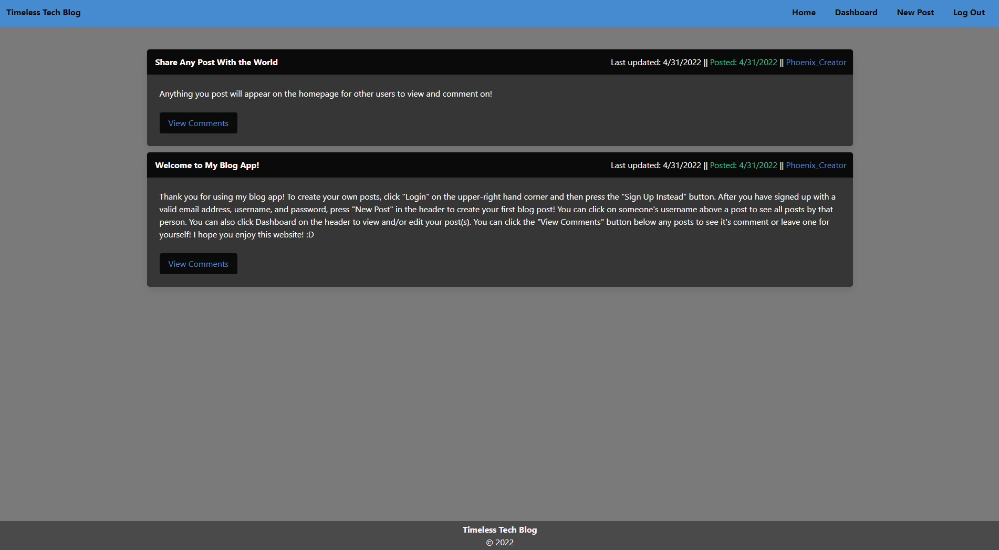
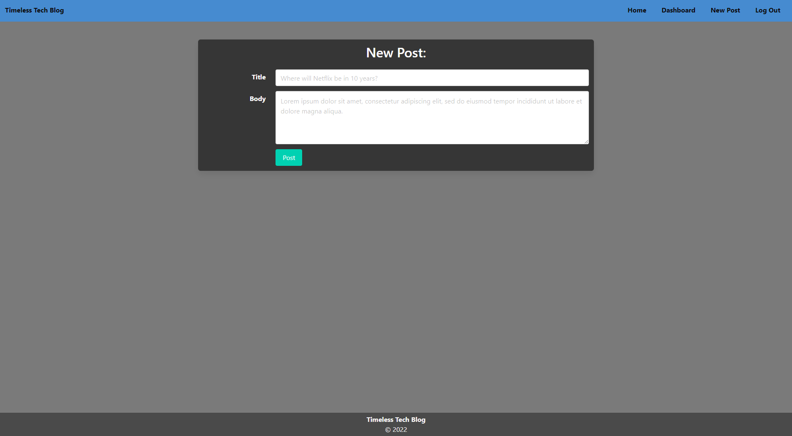
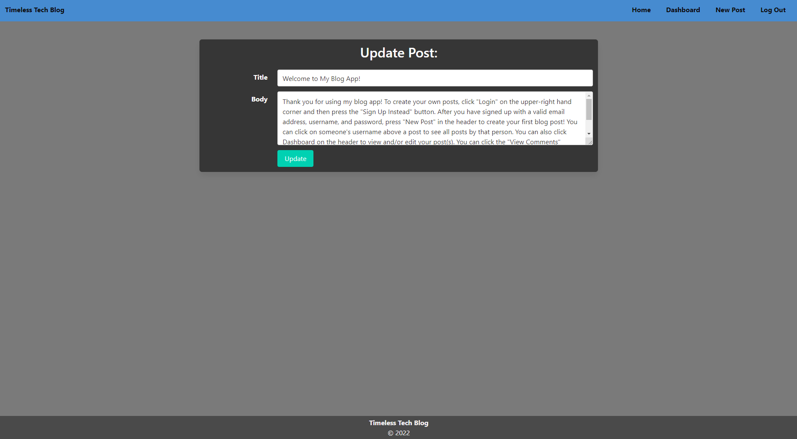
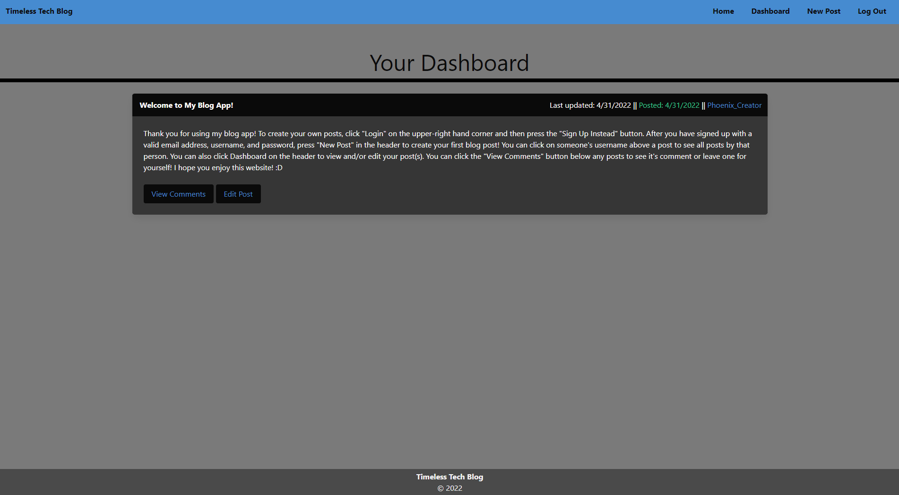
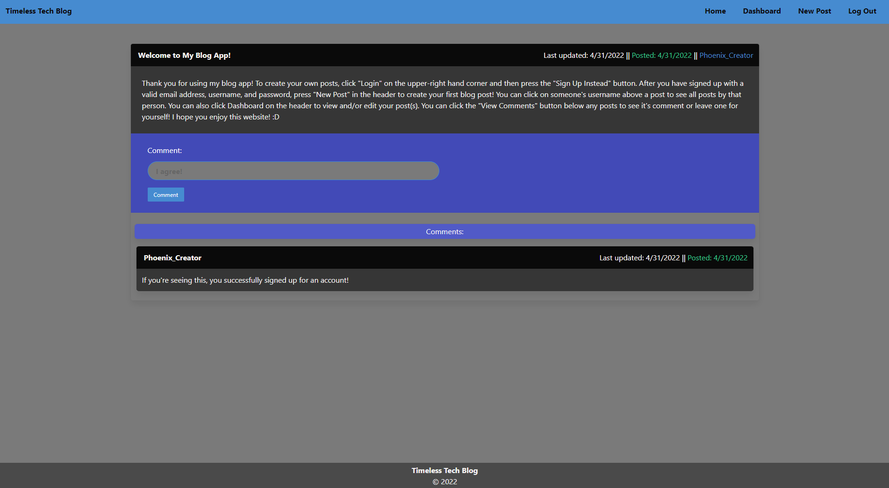

### Apache-2.0 License
 

# Timeless Tech Blog

## Table of Contents

- [Description](#Description)

- [Description](#Description)

- [Usage with Examples](#Usage)

- [Contribute](#Contribute)

## Description
This website is a place where anyone can sign up and create posts about their favorite piece of tech, their technical opinions, etcetera. To view comments or create posts, users must first sign up or login. This requires navigating to the respective page and entering a valid email, username (if signing up), and password. When logging in, the password is then encrypted and compared to the encrypted password stored in the database.
View the live site [here](https://intense-ridge-45065.herokuapp.com/)!

## Technologies
This website uses various technologies to render webpages dynamically, including Node as a JavaScript runtime environment, Express to handle HTTP requests, Express-Handlebars as a rendering engine, Express-Session to keep track of user sessions, Sequelize to interact with a SQL databse, bcrypt to encrypt user passwords, and dotenv to encorperate MySQL usernames/passwords securely.

## Usage with Examples
- View the most recent posts from other users

- Create new posts and share them with the world

- Update existing posts

- View all of your posts

- Comment on other posts

## Contribute
If you wish to contribute or have any questions, please don't hesitate to [email me](mailto:PhoenixStaley_Developer@outlook.com)!
